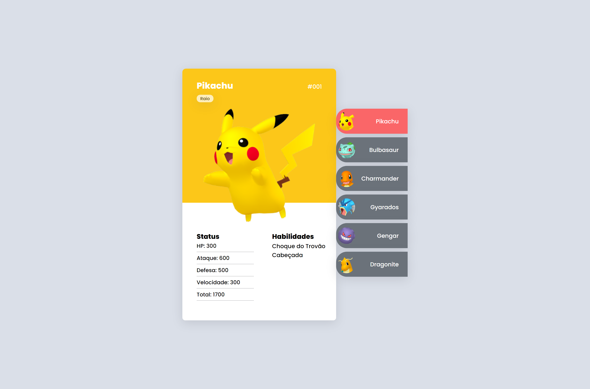

# Pokédex - Projeto MapaDev Week

Pokédex feita seguindo os ensinamentos da MapaDev Week, organizada por Dev em Dobro. Para a realização do projeto foram usadas as seguintes tecnologias:
HTML, CSS e JavaScript.

Lista de Pokemons:
* Pikachu
* Bulbasaur 
* Charmander
* Gyarados
* Gengar
* Dragonite

